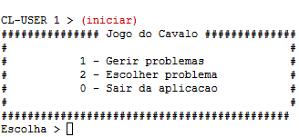
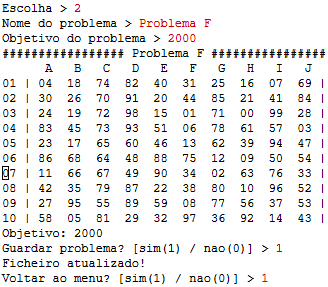
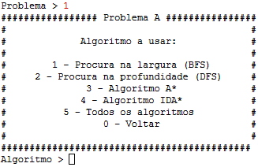
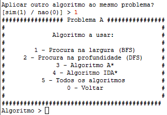

# **Manual de Utilizador**

## Inteligência Artificial | Projeto 1 - Jogo do Cavalo | André Meseiro 202100225 e Pedro Anjos 202100230

### 1. Objetivos do programa e descrição geral do seu funcionamento

O objetivo do programa é resolver o "Jogo do Cavalo", que decorre num tabuleiro 10x10, em que cada casa contém valores (pontuações) entre 00 e 99, sem repetição, distribuídos de forma aleatória cada vez que se inicia um novo jogo.

As regras de funcionamento adotadas para este problema específico são as seguintes:

* Apenas existe um jogador (cavalo branco);

* O jogo tem início com a colocação do cavalo numa casa à escolha, da 1ª linha do tabuleiro (A1-J1);

* As jogadas são efetuadas através de um movimento de cavalo, usando as regras tradicionais do Xadrez para o cavalo;

* Quando o jogador efetua uma jogada, o valor da casa de onde o jogador saiu é apagado, e a casa torna-se inacessível para o resto do jogo;

* Se a casa escolhida tiver um número com dois dígitos diferentes, por exemplo 24, o seu número simétrico, neste caso 42, é apagado do tabuleiro, ficando a respetiva casa inacessível durante o resto do jogo, não podendo terminar outra jogada na mesma;

* Se o cavalo for colocado numa casa com um número "duplo", por exemplo 33, o jogador pode remover qualquer outro número duplo do tabuleiro, à sua escolha (por *default* remove-se a de maior valor);

* Cada vez que uma casa é visitada, o valor da mesma é somado à pontuação do jogador; a remoção de simétricos e "duplos" não tem pontuação associada;

* O jogador apenas pode efetuar 8 movimentos por jogada e define uma pontuação objetivo a atingir antes de iniciar o jogo;

* O estado final é atingido quando o cavalo chega a uma casa que lhe permite obter uma pontuação igual ou superior ao objetivo definido;

* Se não for possível atingir o objetivo definido, o jogador será informado.

### 2. Utilização do programa (com exemplos)

* Inicialização do programa - Executando a função 'iniciar'

    

* Gestão de problemas - Introduzindo '1'

    

* Criação de um problema - Introduzindo '1'

    

* Geração de um tabuleiro aleatório - Introduzindo '2'

    

* Listagem de problemas - Introduzindo '2'

    

* Backup dos problemas - Introduzindo '3'

    

* Escolha de um problema - Introduzindo '2'

    

* Escolha de um algoritmo para resolver o problema - Introduzindo '1' para utilizar o algoritmo BFS, '2' para utilizar o algoritmo DFS, '3' para utilizar o algoritmo A*, '4' para utilizar o algoritmo IDA*, '5' para utilizar todos ou '0' para voltar atrás

    

* Visualização da solução de um problema - É possível aplicar outro algoritmo ao mesmo problema, introduzindo '1', ou não, introduzindo '0' para voltar ao menu inicial

    

* Aplicar outro algoritmo - Introduzindo '1'

    

* Voltar ao menu inicial - Introduzindo '0' - É possível voltar ao menu inicial, ou terminar o programa

    

* Voltar - Introduzindo '1'

    

* Sair do programa - Introduzindo '0'

    

### 3. Informação necessária e produzida - *Input* e *Output* (ecrã/teclado e ficheiros)

* Input

  * É necessário chamar a função 'iniciar', para iniciar o programa, fazendo (iniciar);

  * É necessário introduzir um nome e objetivo para um problema criado com um tabuleiro gerado aleatoriamente;

  * É necessário introduzir caracteres numéricos para selecionar as opções do menu, por exemplo, '0' para voltar atrás/não e '1' para selecionar a primeira opção/sim;

* Output

  * Menu inicial no ecrã, após chamar a função 'iniciar';

  * Tabuleiro aleatório que foi gerado associado ao problema criado, com o objetivo definido;

  * Resultados de uma experiência (resolução de um problema com um determinado algoritmo ou com todos os algoritmos) no ecrã, após introduzir a escolha do problema e do algoritmo;

  * Cada vez que é criado um novo problema, o mesmo é escrito para um ficheiro problemas.dat

  * Cada vez que é executada uma experiência, a mesma é escrita para um ficheiro log.dat

### 4. Limitações do programa (do ponto de vista do utilizador)

As limitações que podem ser encontrada no programa, de natureza não técnica, são a interface não ser a mais apelativa, e o facto do programa funcionar apenas após chamar a função 'iniciar' e posteriormente com a introdução de caracteres, em vez de existir uma interface "clicável" e mais apelativa visualmente.
